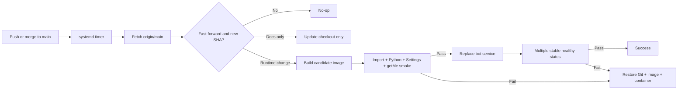

# Telegram Bot Autodeploy Template

Write bot handlers, deploy once, then update your single-VPS Telegram bot by
pushing to `main`.

**Suggested GitHub description:** Production-ready Python Telegram bot template
for a single VPS: Docker, CI, push-to-main auto-deploy, health checks and
automatic rollback.

Suggested topics: `telegram-bot`, `telegram-bot-template`, `python`, `docker`,
`vps`, `auto-deploy`, `systemd`, `devops`, `self-hosted`.

[Русская документация](docs/README.ru.md)

## Features

- Python 3.12 container; Python 3.11, 3.12, and 3.13 development/CI support.
- `pyTelegramBotAPI` long polling with import-safe, explicit lifecycle code.
- Non-root, read-only Docker Compose service with no Linux capabilities.
- Telegram `getMe` candidate validation and strict heartbeat health checks.
- A project-specific systemd timer that follows only `origin/main`.
- Fast-forward deployment, failed-SHA suppression, and automatic rollback.
- Idempotent Ubuntu 22.04/24.04 installer that preserves configuration and data.
- Ruff, pytest, ShellCheck, Docker, and fake production-flow checks in one CI
  workflow.

## What this template is

This is a deliberately small foundation for one long-polling Telegram bot in
one Docker container on one Ubuntu VPS. The included bot responds to `/start`,
`/help`, and echoes ordinary text. Replace or extend those handlers with your
own application logic.

## What this template is not

It is not a multi-host platform and does not include a database, Redis, a task
queue, webhooks, a reverse proxy, Kubernetes, payments, or an admin panel. Add
infrastructure in the repository created from this template only when your bot
actually needs it.

## Architecture



The VPS pulls from GitHub. GitHub Actions never needs SSH access or VPS secrets.
Detection is timer-based rather than immediate: a push normally reaches the VPS
on the next check, approximately two minutes later.

## Use this template

1. In this source repository, open **GitHub Settings** and select
   **Template repository**.
2. Click **Use this template**, create your own repository, and keep `main` as
   its production branch.
3. Clone your generated repository and customize `app/handlers/common.py`.
4. Push it to GitHub, then clone that repository on the VPS.
5. Run `sudo`-capable `./install.sh` once on the VPS.

A push or merge to `main` is deployed by the VPS timer. A push to a feature
branch runs CI but is not deployed. Creating a repository from the template
does not install anything on a server: run `install.sh` once for every generated
project. The repository owner also configures `origin`, enables the Template
Repository setting, and enables branch protection and required CI checks
manually.

## Quick start

Local:

```bash
git clone https://github.com/YOUR_ACCOUNT/YOUR_REPOSITORY.git
cd YOUR_REPOSITORY
python -m venv .venv
source .venv/bin/activate
python -m pip install -r requirements-dev.txt
cp .env-example .env
# Set BOT_TOKEN in .env, then:
python main.py
```

Ubuntu VPS:

```bash
git clone https://github.com/YOUR_ACCOUNT/YOUR_REPOSITORY.git
cd YOUR_REPOSITORY
./install.sh
```

The installer creates `.env` only when absent, prompts for an empty token
without echoing it, builds and validates the image, starts the bot, and prints
the exact unique service and timer names.

## Local development

The `.env` loader is intentionally small: it accepts simple `KEY=VALUE` lines,
does not execute shell syntax, and lets process environment variables override
file values.

```bash
python -m pip install -r requirements-dev.txt
cp .env-example .env
python main.py

python -m ruff check .
python -m ruff format --check .
python -m pytest
```

`python -c "import main"` is a safe smoke test. It does not read a required
token, make network calls, register handlers, start threads, or create files.

## Configuration

`.env` is used unchanged by local Python, Docker Compose, candidate smoke tests,
repeated installs, deployments, and rollbacks. It is ignored by Git and by the
Docker build context. **Never commit `.env`.**

`.env-example` is only a documented sample and the input for static Compose
validation. `ENV_FILE=.env-example docker compose config` can validate the
Compose model in a fresh checkout without creating `.env`. The `ENV_FILE`
override is a technical check mechanism; production defaults to `.env`, and a
real container or production deployment still fails closed when `.env` is
missing.

| Variable | Default | Purpose |
| --- | --- | --- |
| `BOT_TOKEN` | empty | Required at startup; obtain it from BotFather. |
| `APP_NAME` | repository directory | Source for the unique lowercase app slug. |
| `LOG_LEVEL` | `INFO` | `DEBUG`, `INFO`, `WARNING`, `ERROR`, or `CRITICAL`. |
| `DATA_DIR` | `data` | Persistent application data directory. |
| `LOGS_DIR` | `logs` | Persistent logs and daily rotated `bot.log`. |
| `POLLING_TIMEOUT_SECONDS` | `20` | pyTelegramBotAPI polling timeout. |
| `LONG_POLLING_TIMEOUT_SECONDS` | `30` | Telegram long-poll timeout. |
| `HEALTH_HEARTBEAT_SECONDS` | `25` | `/tmp` marker refresh interval. |
| `HEALTH_MAX_AGE_SECONDS` | `120` | Maximum healthy marker age. |

Choose an `APP_NAME` that becomes 3–63 characters of `a-z`, `0-9`, and hyphens.
The installer derives a safe slug and uses it for the image, Compose project,
lock, deployment state, logs, and systemd units. Different generated
repositories can therefore run on the same VPS without naming conflicts.

## Add handlers

Edit `app/handlers/common.py`. Register additional decorated handler functions
inside `register_handlers(bot)`, or import registration functions from new
modules and call them there. Keep registration out of module-level code: the
application calls it only after directories and Telegram `getMe` have
succeeded.

Avoid showing raw exception text to Telegram users. Log a generic operational
message and let the file logger retain the traceback.

## Initial installation on an Ubuntu VPS

Requirements are Ubuntu 22.04 or 24.04, a checkout on `main`, an `origin`
remote, outbound HTTPS, and a user with root or sudo access.

```bash
git clone https://github.com/YOUR_ACCOUNT/YOUR_REPOSITORY.git
cd YOUR_REPOSITORY
./install.sh
```

The installer installs Git, Docker, Compose, `flock`, and CA certificates when
needed. It uses sudo for Docker consistently when the current account cannot
access the socket. Existing `.env`, `data/`, and `logs/` are never replaced.
Tracked local changes stop installation. Updates use `git pull --ff-only`.

For a manual Docker-only setup:

```bash
cp .env-example .env
# Set BOT_TOKEN and APP_NAME in .env.
mkdir -p data logs
sudo chown -R 10001:10001 data logs
export APP_SLUG=my-telegram-bot
docker compose build bot
bash scripts/smoke-test.sh
docker compose up -d --no-deps bot
```

## Automatic deployment

About every two minutes, `<app-slug>-deploy.timer` starts a one-shot service.
The deploy script takes a project-specific `flock`, rejects a dirty checkout,
fetches only `origin/main`, verifies a fast-forward, and compares exact SHAs.

Documentation-only changes advance the checkout without building or restarting
the container. Runtime changes tag the current image for rollback, build a
candidate, run imports, verify Python 3.12 and settings, and call Telegram
`getMe`. Only then is the `bot` service recreated. Success requires several
consecutive observations of `running=true`, restart count `0`, and
`health=healthy`. `none`, `starting`, `unhealthy`, and unknown states fail.

If a SHA fails, Git, the image, systemd units, and the previous running state
are restored. That SHA is recorded in `data/.failed-deploy-sha` and is not
retried until a newer commit arrives. Set `FORCE_DEPLOY=1` only for a deliberate
manual retry.

## Rollback

Every successful runtime deployment records the previous commit and retains its
image. A manual rollback asks for explicit confirmation:

```bash
sudo ./scripts/rollback.sh
```

Automation may use:

```bash
sudo ./scripts/rollback.sh --yes
```

The script uses the same lock as deployment, shows both commits and the image,
recreates only the bot service, and requires strict stable health. It never
removes `.env`, `data/`, or `logs/`.

## Operations

Replace `my-telegram-bot` with the app slug printed by `install.sh`.

```bash
# Container status
APP_SLUG=my-telegram-bot docker compose ps

# Application and deployment logs
APP_SLUG=my-telegram-bot docker compose logs -f --tail=200 bot
sudo tail -f logs/my-telegram-bot-deploy-$(date -u +%F).log

# Restart only the bot
APP_SLUG=my-telegram-bot docker compose restart bot

# Manual deploy check
sudo APP_SLUG=my-telegram-bot ./scripts/deploy.sh

# Manual rollback
sudo APP_SLUG=my-telegram-bot ./scripts/rollback.sh

# Timer and last deployment status
sudo systemctl status my-telegram-bot-deploy.timer
sudo systemctl status my-telegram-bot-deploy.service
sudo journalctl -u my-telegram-bot-deploy.service -n 100 --no-pager
```

## Troubleshooting

**Invalid `BOT_TOKEN`.** Correct `.env`, keep it mode `0600`, then run the
manual deploy. The candidate smoke test verifies `getMe` before replacement and
redacts token-shaped output.

**Docker permission denied.** Run through a sudo-capable account. The installer
automatically selects either direct Docker access or `sudo docker`. For manual
Compose commands, prefix them with `sudo` if needed.

**Dirty Git checkout.** Move application customization into a commit and push
it. Deployment intentionally refuses tracked local edits because rollback could
otherwise destroy them.

**`health=unhealthy` (or `none`).** Inspect `docker compose logs bot` and
`logs/bot.log`. Confirm `data/` and `logs/` are owned by UID/GID `10001`. A
missing healthcheck is an error, not a success.

**Duplicate polling / Telegram 409.** One Telegram token must not be polled by
two containers or processes at once. Stop the other deployment before starting
this one.

**Failed SHA is skipped.** Inspect `data/.failed-deploy-sha` and deployment
logs. Fix the problem and push a newer commit. For a reviewed transient failure,
run `sudo FORCE_DEPLOY=1 APP_SLUG=my-telegram-bot ./scripts/deploy.sh`.

**Timer is not loaded.** Run `sudo systemctl daemon-reload`, then
`sudo systemctl enable --now my-telegram-bot-deploy.timer`. Check
`systemctl list-timers` and the exact slug printed by the installer.

## Security notes

- The container runs as UID/GID `10001`, with a read-only root filesystem,
  dropped capabilities, `no-new-privileges`, a small `/tmp` tmpfs, and writable
  mounts only for `data/` and `logs/`.
- The health marker is ephemeral at `/tmp/telegram-bot.healthy`; persistent data
  cannot accidentally make a dead process healthy.
- The bot token is absent from the image and Git. Logging redacts token-shaped
  strings, and console logs omit tracebacks.
- Anyone able to merge to `main` can deploy code to the VPS. Protect `main`,
  require CI, review dependency changes, and limit repository write access.
- Rotate tokens after suspected exposure and keep Ubuntu and Docker patched.

The shell deployment, installer, and rollback regression tests use fake
`git`, `docker`, `systemctl`, and `flock` commands. They exercise transaction
logic without contacting Telegram or changing the host. Before production use,
run the [clean Ubuntu VPS acceptance checklist](docs/VPS_ACCEPTANCE.md) with
dedicated test bots.

## Customization checklist

- [ ] Set the generated repository's description and topics shown above.
- [ ] Confirm **Settings → Template repository** if this repository will itself
      remain a reusable template.
- [ ] Replace the example handlers and user-facing messages.
- [ ] Add focused tests for every handler.
- [ ] Set `APP_NAME` and `BOT_TOKEN` in the VPS `.env`.
- [ ] Protect `main` and require the CI workflow.
- [ ] Review `SECURITY.md`, ownership, and contact information.
- [ ] Test a deployment and `scripts/rollback.sh` before relying on the bot.
- [ ] Complete `docs/VPS_ACCEPTANCE.md` on a clean Ubuntu 22.04/24.04 VPS.

## Limitations

- One bot process, one container, one Ubuntu VPS, and long polling only.
- Brief downtime is possible while Compose replaces the container.
- Deployment depends on GitHub and Telegram being reachable from the VPS.
- There is no cross-host failover, secret manager, backup system, or zero-downtime
  handoff.
- Docker image rollback cannot undo external side effects introduced by custom
  handlers.
- Automated tests do not replace an acceptance run against a real Docker and
  systemd installation on the target Ubuntu VPS.

## Contributing

See [CONTRIBUTING.md](CONTRIBUTING.md). Keep proposals aligned with a minimal
single-bot, single-VPS scope and never include real tokens in tests or issues.

## License

MIT. See [LICENSE](LICENSE).
