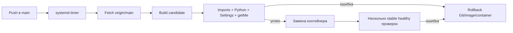

# Telegram Bot Autodeploy Template

Пишите handlers, один раз установите бота на VPS, а затем обновляйте его обычным
push/merge в `main`.

Это минимальный шаблон для одного Telegram-бота с long polling в одном
Docker-контейнере на одном Ubuntu VPS. В нём нет базы данных, Redis, webhook,
reverse proxy, очередей и Kubernetes.

## Как это работает



Push в feature branch запускает CI, но не deployment. VPS самостоятельно
проверяет только `origin/main` примерно раз в две минуты, поэтому deployment
после push происходит не мгновенно. GitHub Actions не подключается к VPS по SSH.

## Создание репозитория

1. Для исходного репозитория отметьте **GitHub Settings → Template repository**.
2. Нажмите **Use this template** и создайте свой репозиторий.
3. Клонируйте его, измените `app/handlers/common.py`, добавьте тесты и отправьте
   изменения в GitHub.
4. На Ubuntu VPS выполните:

```bash
git clone https://github.com/YOUR_ACCOUNT/YOUR_REPOSITORY.git
cd YOUR_REPOSITORY
./install.sh
```

Installer установит Docker/Git/Compose/flock, создаст `.env` только при его
отсутствии, безопасно запросит пустой `BOT_TOKEN`, соберёт и проверит image,
запустит контейнер и включит уникальный systemd timer.

Создание GitHub template не устанавливает deployment автоматически:
`install.sh` нужно один раз запустить для каждого нового проекта. Владелец
репозитория вручную настраивает `origin`, включает Template Repository, branch
protection и обязательный CI.

## Локальная разработка

```bash
python -m venv .venv
source .venv/bin/activate
python -m pip install -r requirements-dev.txt
cp .env-example .env
# Заполните BOT_TOKEN
python main.py
```

Проверки:

```bash
python -m ruff check .
python -m ruff format --check .
python -m pytest
python -c "import main"
```

Последняя команда немедленно завершается без токена, network calls, threads,
регистрации handlers и создания файлов.

## `.env`

`.env` одинаково используется локально, в Docker, smoke tests, повторном
installer и rollback. Он не попадает в Git и Docker image. **Никогда не
коммитьте `.env`.**

`.env-example` используется только как образец и для статической проверки:

```bash
ENV_FILE=.env-example docker compose config --quiet
```

Эта команда не создаёт `.env`. `ENV_FILE` — техническая возможность для
checks; production default остаётся `.env`, и реальный container/deployment
без него должен завершиться ошибкой.

Основные параметры: `BOT_TOKEN`, `APP_NAME`, `LOG_LEVEL`, `DATA_DIR`,
`LOGS_DIR`, polling timeouts и интервалы health heartbeat. Installer преобразует
`APP_NAME` (или имя Git-каталога) в уникальный slug из `a-z`, `0-9` и дефисов.
Slug разделяет Docker images, Compose projects, locks и systemd units разных
ботов на одном VPS.

## Handlers

Добавляйте регистрацию в `register_handlers(bot)` внутри
`app/handlers/common.py` или вызывайте оттуда функции новых модулей. Не
регистрируйте handlers на уровне import: startup делает это только после
успешного Telegram `getMe`.

## Deployment и rollback

Deployment разрешён только из чистой ветки `main` и только fast-forward до
`origin/main`. Docs-only commit обновляет checkout без build и restart.
Runtime-изменение сначала собирает candidate image и проверяет import, Python
3.12, Settings и Telegram `getMe`. Контейнер заменяется только после успешного
smoke test.

Успех требует нескольких последовательных состояний `running=true`,
`restart count=0`, `health=healthy`. Состояния `none`, `starting`, `unhealthy`
и unknown считаются ошибкой. При сбое восстанавливаются commit, image,
container и systemd units. Неудачный SHA записывается и повторно не запускается
до появления нового commit.

Ручной rollback:

```bash
sudo ./scripts/rollback.sh
# Для automation:
sudo ./scripts/rollback.sh --yes
```

`.env`, `data/` и `logs/` не удаляются ни при deployment, ни при rollback.

## Операционные команды

Замените `my-telegram-bot` на slug, который напечатал installer:

```bash
APP_SLUG=my-telegram-bot docker compose ps
APP_SLUG=my-telegram-bot docker compose logs -f --tail=200 bot
APP_SLUG=my-telegram-bot docker compose restart bot
sudo APP_SLUG=my-telegram-bot ./scripts/deploy.sh
sudo APP_SLUG=my-telegram-bot ./scripts/rollback.sh
sudo systemctl status my-telegram-bot-deploy.timer
sudo systemctl status my-telegram-bot-deploy.service
```

Для manual Docker setup перед запуском обязательно:

```bash
sudo chown -R 10001:10001 data logs
```

## Частые проблемы

- **Invalid token:** исправьте `BOT_TOKEN` в `.env`; token проверяется до замены
  контейнера и не должен попадать в logs.
- **Docker permission denied:** используйте sudo-capable пользователя; installer
  сам выбирает прямой Docker или `sudo docker`.
- **Dirty checkout:** закоммитьте и отправьте tracked changes.
- **Unhealthy/none:** проверьте container logs, `logs/bot.log` и владельца
  `data/`, `logs/`.
- **Telegram 409:** один token нельзя одновременно polling-ить двумя
  контейнерами.
- **Failed SHA:** исправьте проблему и отправьте новый commit либо осознанно
  запустите manual deploy с `FORCE_DEPLOY=1`.
- **Timer не загружен:** выполните `systemctl daemon-reload` и
  `systemctl enable --now <slug>-deploy.timer`.

## Безопасность и ограничения

Контейнер работает как `10001:10001`, с read-only root filesystem, без
capabilities, с `no-new-privileges` и ephemeral marker
`/tmp/telegram-bot.healthy`. Writable только bind mounts `data/` и `logs/`.

Доступ на запись в `main` фактически даёт возможность запускать код на VPS:
включите branch protection и review. Один VPS не даёт failover или zero-downtime
гарантий. Обновляйте Ubuntu/Docker и немедленно перевыпускайте скомпрометированный
token.

Shell regression tests используют fake `git`, `docker`, `systemctl` и `flock`:
они не обращаются к Telegram и не заменяют проверку настоящего VPS. Перед
production выполните [checklist для чистой Ubuntu VPS](VPS_ACCEPTANCE.md),
желательно с отдельными тестовыми ботами.

Полное описание архитектуры, customization checklist, contributing и license
находятся в [основном README](../README.md).
