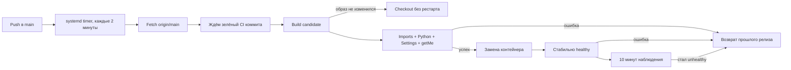

# Telegram Bot Autodeploy Template

Пишите handlers, один раз установите бота на VPS, а затем обновляйте его обычным
push/merge в `main`.

Это минимальный шаблон для одного Telegram-бота с long polling в одном
Docker-контейнере на одном Ubuntu VPS. В нём нет базы данных, Redis, webhook,
reverse proxy, очередей и Kubernetes. Каждый бот, созданный из шаблона,
полностью самостоятелен: он ничего не знает ни о шаблоне, ни о других ботах на
том же сервере.

## Как это работает


```mermaid
flowchart LR
    A[Push в main] --> B[systemd timer, каждые 2 минуты]
    B --> C[Fetch origin/main]
    C --> D[Ждём зелёный CI коммита]
    D --> E[Build candidate]
    E -->|образ не изменился| K[Checkout без рестарта]
    E --> F[Imports + Python + Settings + getMe]
    F -->|успех| G[Замена контейнера]
    G --> H[Стабильно healthy]
    H --> I[10 минут наблюдения]
    F -->|ошибка| R[Возврат прошлого релиза]
    H -->|ошибка| R
    I -->|стал unhealthy| R
```

Push в feature branch запускает CI, но не deployment. VPS сам проверяет
`origin/main` раз в две минуты и выкатывает новый коммит, как только прошли его
проверки в GitHub. Отдельной ветки для деплоя нет, ничего нажимать не нужно.
GitHub Actions не подключается к VPS по SSH и не хранит секретов сервера.

## Создание репозитория

1. Для исходного репозитория отметьте **GitHub Settings → Template repository**.
2. Нажмите **Use this template** и создайте свой репозиторий.
3. Клонируйте его, измените `app/handlers/common.py`, добавьте тесты и отправьте
   изменения в GitHub.
4. На Ubuntu 22.04 или 24.04 от любого пользователя и в любой каталог:

```bash
git clone https://github.com/YOUR_ACCOUNT/YOUR_REPOSITORY.git
cd YOUR_REPOSITORY
sudo bash install.sh
```

Installer установит Docker, Git, Compose, `flock`, `curl` и Python 3, если их
нет, создаст `.env` только при его отсутствии, безопасно запросит пустой
`BOT_TOKEN`, соберёт и проверит образ, запустит контейнер и включит таймеры
этого проекта: деплой и еженедельную пересборку. Git при этом работает от
имени владельца каталога, поэтому ваши собственные команды `git` не ломаются.

Повторный запуск `install.sh` безопасен: `.env`, `data/` и `logs/` сохраняются,
поэтому это же и способ починить установку.

## Локальная разработка

```bash
python -m venv .venv
source .venv/bin/activate
python -m pip install -r requirements-dev.txt
cp .env-example .env
# Заполните BOT_TOKEN отдельного тестового бота
python main.py
```

Для локальной разработки используйте отдельный токен тестового бота. Один токен
нельзя одновременно опрашивать с ноутбука и с сервера: Telegram отвечает 409, и
бот на сервере станет unhealthy.

Проверки:

```bash
python -m ruff check .
python -m ruff format --check .
python -m pytest
python -c "import main"
bash tests/shell/test-deploy.sh
bash tests/e2e/in-docker.sh   # около 10 минут, нужен Docker
```

`python -c "import main"` завершается без токена, сетевых вызовов, потоков,
регистрации handlers и создания файлов.

Shell-тесты деплоя работают с настоящими Git-репозиториями и имитацией
`docker`, `systemctl`, `flock` и GitHub API. Сквозной тест запускает настоящие
`install.sh` и скрипты деплоя на настоящем Docker с поддельным Telegram API
внутри одноразового Docker-in-Docker контейнера, поэтому ваши контейнеры и
образы не затрагиваются. CI запускает его на каждый push.

## `.env`

`.env` одинаково используется локально, в Docker, smoke tests, повторном
installer и rollback. Он не попадает в Git и Docker image. **Никогда не
коммитьте `.env`.**

`.env-example` используется только как образец и для статической проверки:

```bash
ENV_FILE=.env-example docker compose config --quiet
```

Основные параметры: `BOT_TOKEN`, `APP_NAME`, `LOG_LEVEL`, `DATA_DIR`,
`LOGS_DIR`, polling timeouts, `HEALTH_MAX_AGE_SECONDS` и необязательный
`TELEGRAM_API_URL` для собственного Bot API сервера. Installer преобразует
`APP_NAME` (или имя каталога) в уникальный slug из `a-z`, `0-9` и дефисов и
закрепляет его в `.env` как `APP_SLUG`. Slug разделяет Docker images, Compose
projects, locks и systemd units разных ботов на одном VPS, а переименование
каталога ничего не ломает.

## Настройки деплоя

[`deploy.conf`](../deploy.conf) лежит в репозитории, поэтому изменение
настроек — обычный коммит.

| Настройка | По умолчанию | Что делает |
| --- | --- | --- |
| `DEPLOY_BRANCH` | `main` | Ветка, коммиты которой выкатываются |
| `REQUIRE_CI` | `auto` | Ждать проверок GitHub: `auto`, `yes` или `no` |
| `CI_WAIT_MINUTES` | `30` | Выкатить без CI, если он так и не запустился |
| `REBUILD_SCHEDULE` | `Sun *-*-* 04:00:00` | Плановая пересборка ради обновлений безопасности; пусто — выключено |
| `REBUILD_VERSION_CMD` | пусто | Перезапуск после пересборки только при изменении вывода команды |
| `SMOKE_COMMAND` | пусто | Дополнительная проверка нового образа до запуска |
| `WATCH_MINUTES` | `10` | Сколько минут следить за свежим релизом |
| `KEEP_RELEASES` | `3` | Сколько старых релизов хранить для отката |

Плановая пересборка перезапускает бота только если образ действительно
изменился. Боты на быстро меняющейся библиотеке, например yt-dlp, могут
пересобираться каждую ночь и перезапускаться только при выходе новой версии:

```dockerfile
# Dockerfile: всё после этой строки пересобирается при плановой пересборке
ARG REBUILD_STAMP
RUN pip install --no-cache-dir --upgrade yt-dlp
```

```ini
# deploy.conf
REBUILD_SCHEDULE="*-*-* 03:30:00"
REBUILD_VERSION_CMD="python -m yt_dlp --version"
```

Для приватного репозитория положите fine-grained токен GitHub с доступом только
на чтение Checks в `.deploy/github-token` (права `0600`), чтобы таймер видел
результаты CI. Сам Git использует доступ владельца каталога, например deploy key.

## Handlers

Добавляйте регистрацию в `register_handlers(bot)` внутри
`app/handlers/common.py` или вызывайте оттуда функции новых модулей. Не
регистрируйте handlers на уровне import: startup делает это только после
успешного Telegram `getMe`.

## Deployment и rollback

Deployment разрешён только из чистой ветки `main` и только fast-forward до
`origin/main`.

1. Если в коммите есть `.github/workflows`, таймер ждёт проверок GitHub.
   Упавший CI никогда не выкатывается. Если CI не запустился за 30 минут
   (например, в форке выключены Actions), коммит выкатывается без него.
2. Собирается candidate image. Если он совпадает с работающим (правка README
   или тестов), checkout продвигается, а бот продолжает работать без рестарта.
3. Candidate проверяет import, Python 3.12, Settings и Telegram `getMe`.
4. Контейнер заменяется, и нужно несколько подряд проверок: запущен нужный
   образ, `healthy`, ноль перезапусков.
5. Ещё 10 минут таймер следит за релизом. Если бот стал unhealthy или
   перезапустился, прошлый релиз возвращается автоматически.

«Healthy» значит, что Telegram ответил на последний `getUpdates` бота. Поэтому
отозванный токен, отсутствие сети или второй экземпляр с тем же токеном (409)
считаются поломкой.

При любом сбое возвращаются прошлый коммит, тот самый образ, на котором он
работал, и контейнер. Упавший коммит пропускается до появления нового.
Деплой, прерванный перезагрузкой сервера, откатывается и повторяется один раз.

У каждого релиза свой тег образа. Хранятся текущий, прошлый и ещё два более
старых, остальное удаляется, так что диск не забивается.

## Операционные команды

Из каталога проекта на VPS:

```bash
sudo bash scripts/status.sh             # что запущено, куда можно откатиться, чего ждёт деплой
docker compose logs -f --tail=200 bot   # логи бота
sudo bash scripts/deploy.sh             # выкатить сейчас, не дожидаясь таймера
sudo bash scripts/deploy.sh --retry     # повторить упавший коммит
sudo bash scripts/deploy.sh --skip-ci   # выкатить, не дожидаясь CI
sudo bash scripts/rollback.sh           # вернуть прошлый релиз (повтор — вернуть обратно)
```

После ручного отката таймер не трогает бота до следующего push.
`.env`, `data/` и `logs/` не удаляются ни при deployment, ни при rollback.

Для ручной настройки Docker без installer перед запуском обязательно:

```bash
sudo chown -R 10001:10001 data logs
```

## Частые проблемы

Начните с `sudo bash scripts/status.sh`: он показывает работающий релиз, чего
ждёт деплой и что его приостановило.

- **Invalid token:** исправьте `BOT_TOKEN` в `.env` и запустите
  `sudo bash install.sh`; токен проверяется до замены контейнера и не попадает
  в логи.
- **Правки файлов на сервере:** деплой приостанавливается, пока отслеживаемые
  файлы отличаются от Git. Закоммитьте изменение со своей машины, а на сервере
  верните файл через `git checkout -- <файл>`.
- **Unhealthy:** проверьте логи контейнера, `logs/bot.log` и владельца `data/`,
  `logs/`.
- **Telegram 409:** тот же токен опрашивается где-то ещё, например копией бота
  на ноутбуке.
- **Упавший коммит пропускается:** исправьте проблему и отправьте новый коммит
  либо осознанно выполните `sudo bash scripts/deploy.sh --retry`.
- **Таймер не загружен:** запустите `sudo bash install.sh` ещё раз.
- **Бот создан из старой версии шаблона:** перенесите новые `install.sh`,
  `scripts/`, `deploy.conf` и изменения приложения, сделайте push и один раз
  выполните `sudo bash install.sh` на сервере. Работающий контейнер станет
  текущим релизом, старые файлы и теги отката будут убраны.

## Безопасность и ограничения

Контейнер работает как `10001:10001`, с read-only root filesystem, без
capabilities, с `no-new-privileges` и маркером здоровья
`/tmp/telegram-bot.healthy`, который обновляется только успешными `getUpdates`.
Writable только bind mounts `data/` и `logs/`.

Доступ на запись в `main` фактически даёт возможность запускать код на VPS, а
скрипты деплоя работают от root: включите branch protection, обязательный CI,
двухфакторную аутентификацию и review. Один VPS не даёт failover или
zero-downtime гарантий: при замене контейнера бот молчит несколько секунд.
Обновляйте Ubuntu/Docker и немедленно перевыпускайте скомпрометированный токен.

Перед production выполните [checklist для чистой Ubuntu VPS](VPS_ACCEPTANCE.md),
желательно с отдельными тестовыми ботами.

Полное описание архитектуры, customization checklist, contributing и license
находятся в [основном README](../README.md).
